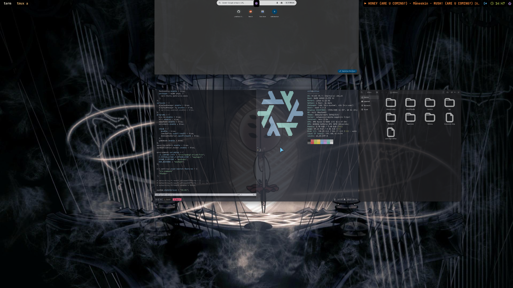
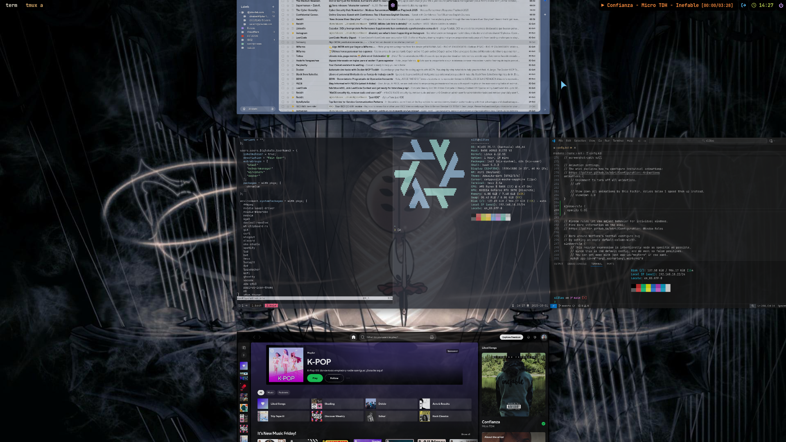

```text
   _____ __ ________    ____  _____
  / ___//  |__  /  |  / __ \/ ___/
  \__ \/ /| |/_ / /| | / / / /\__ \ 
 ___/ / / | |/ /_/ | |/ /_/ /___/ / 
/____/_/  |_/____/ |__\____//____/  
                                    
           NIXOS EDITION
```

# S13LOS

**A specialized NixOS configuration for Pentesting, Development, and Daily Driving.**

Built on **Nix Flakes** and **Home Manager**, this repository defines a reproducible, high-performance environment tailored for the `s13l` persona. It features a modern Wayland stack powered by **Niri**, extensive security tooling, and a sleek, dark-themed UI.





## ⚡ Features

### 🖥️ Desktop Environment
- **Window Manager:** [Niri](https://github.com/YaLTeR/niri) (Scrollable Tiling Wayland Compositor)
- **Bar:** Waybar with custom CSS/styling
- **Terminal:** Ghostty
- **Launcher:** Wofi
- **Lock Screen:** Swaylock-effects
- **Display Manager:** Ly

### 🛡️ Security & Pentesting
Includes a pre-configured `pentest` module with essential tools:
- **Recon:** `amass`, `subfinder`, `nmap`, `gobuster`
- **Web:** `burpsuite`, `ffuf`, `sqlmap`, `caido`
- **Cracking:** `hashcat`, `john`, `thc-hydra`
- **Network:** `wireshark`, `metasploit`

### 🎮 & 🎨 Productivity
- **Gaming:** Steam + Gamemode + Proton support
- **Creative:** DaVinci Resolve, OBS Studio, GIMP, Krita
- **Dev:** Neovim, VSCode, Docker, Go, Python setup
- **Graphics:** Full NVIDIA proprietary driver support with VAAPI

## 🚀 Installation

### 1. Clone & Prepare
Clone this repository to `/etc/nixos` (or your preferred location) and copy your hardware config:

```bash
git clone git@github.com:JotaFab/s13los.git
cp /etc/nixos/hardware-configuration.nix ./s13los/
cd s13los
```

### 2. Configure Identity
Edit `flake.nix` to set your globals. This controls the user account and git identity:

```nix
globals = {
  UserName = "s13l";     # Your system username
  HostName = "s13los";   # Your machine hostname
  GitName = "Your Name"; # Git global name
  GitEmail = "email@.."; # Git global email
};
```

### 3. Build & Switch
Apply the configuration:

```bash
sudo nixos-rebuild switch --flake .#s13los
```

## 📂 Structure

| Path | Description |
|------|-------------|
| `flake.nix` | Entry point & Global variables |
| `configuration.nix` | System-wide settings (Boot, Network, Nvidia, Users) |
| `modules/pentest.nix` | Security tooling suite |
| `modules/home/` | Home Manager user configurations |
| `modules/home/programs/` | Dotfiles for Niri, Waybar, Neovim, etc. |

## 🔧 Maintenance

- **Update System:** `nix flake update && sudo nixos-rebuild switch --flake .#s13los`
- **Clean Garbage:** `nh clean all` (if configured) or `nix-collect-garbage -d`

## 📜 License
MIT
